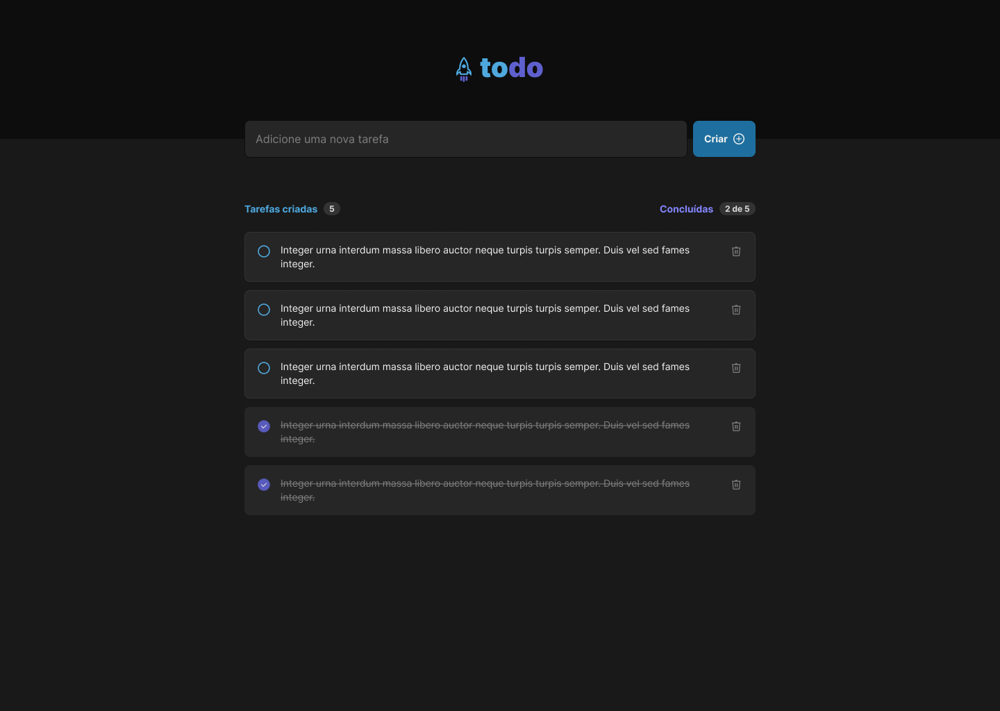
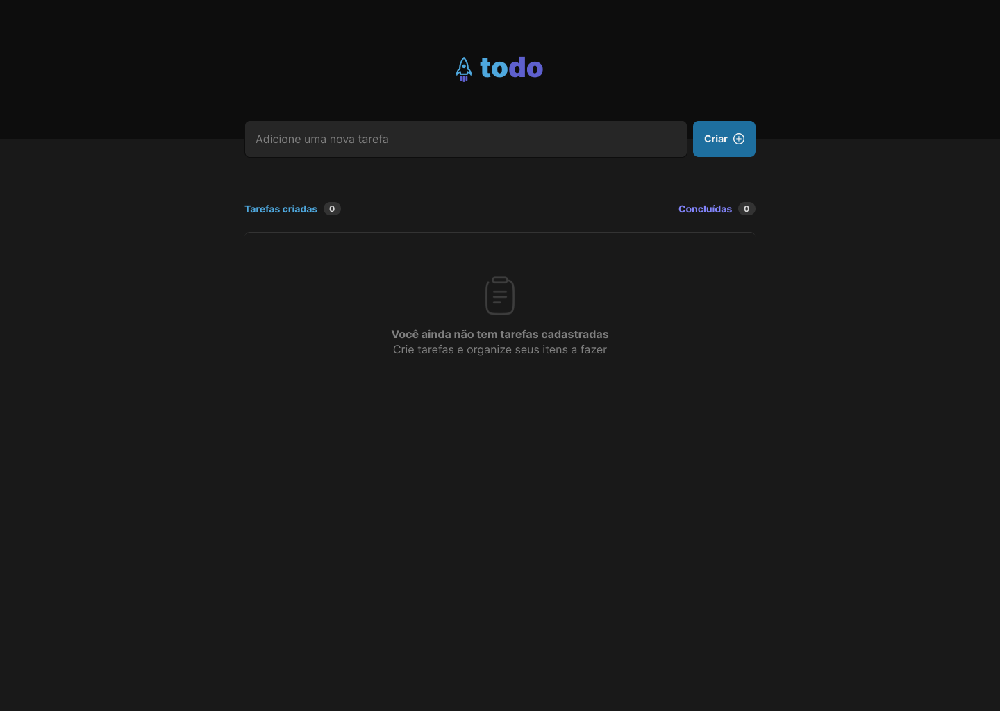

# TO-DO-LIST


## :telescope: Tecnologias:
- React 
- CSS Modules
- ViteJS
- TypeScript


```bash
# Clonar repositorios
$ git clone https://github.com/manuncorrea/to-do-list

# Go into the repository
$ cd to-do-list

# Instale dependências para o front-end e execute o servidor
$ npm install
$ npm run dev

```

## Lista preenchida



## Lista vazia
