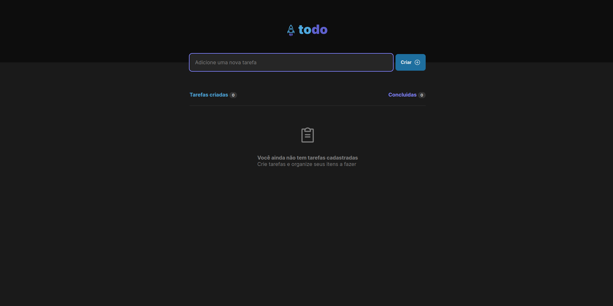

# ToDoList

**Dark** 



## :telescope: Tecnologias:
- React
- Sass
- Styled Components


```bash
# Clonar repositorios
$ git clone https://github.com/manuncorrea/to-do-list

# Go into the repository
$ cd to-do-list

# Instale dependências para o front-end e execute o servidor
$ yarn install
$ yarn dev

# Abra o navegador na siguinte endereço:
http://localhost:8080/

```